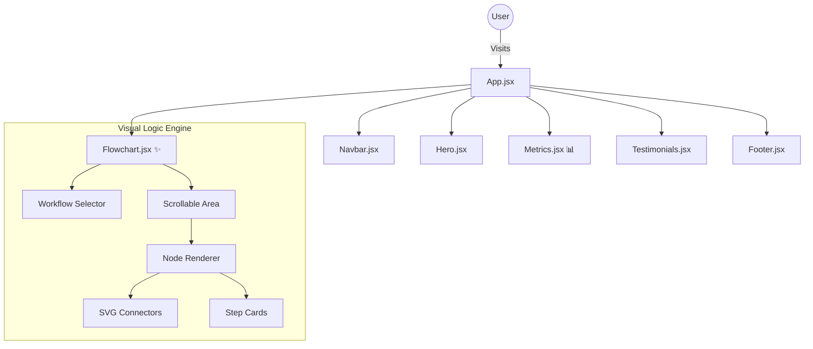

# <div align="center"> <span style="font-size: 2em;">🤖</span> RecruiterAI </div>
<div align="center">
  <strong>Next-Generation AI Recruitment Platform</strong>
  <br>
  <em>"Every Hire, Faster and Better."</em>
</div>
<br>

<div align="center">

[](https://reactjs.org/)
[](https://vitejs.dev/)
[](https://tailwindcss.com/)
[](https://www.framer.com/motion/)

</div>

---

## 🌟 Overview

**RecruiterAI** is a high-performance landing page designed to showcase an intelligent automated hiring solution. This project moves beyond static informational pages, creating an **interactive visual experience** that demonstrates value through motion, data visualization, and interactive logic engines.

The UI acts as a bridge between **corporate professionalism** and **futuristic AI technology**, utilizing a specialized color palette of Slate, Electric Blue, and transparent gradients.

---

## 🚀 Key Interactive Features

### 1. 🧠 Visual Logic Engine (`Flowchart.jsx`)
An architectural breakthrough in displaying recruitment workflows. Instead of boring text lists, users interact with a living flowchart.
*   **Scroll-Triggered Growth:** Nodes spring to life sequentially as the user scrolls, visualizing the flow of data.
*   **Smart Branching:** Displays complex "If/Else" logic with high-contrast SVG connectors (Dotted lines for paths, solid lines for active steps).
*   **Animated "Energy" Lines:** A pulsing vertical beam connects the entire flow, symbolizing continuous automation.

### 2. 📊 ROI Data Visualization (`Metrics.jsx`)
A grid system designed to prove value instantly.
*   **Interactive Hover States:** Hovering over any data bar reveals a deep-dive description overlay, keeping the UI clean while providing depth.
*   **Growth Animations:** Value bars animate vertically upon entering the viewport, drawing the eye to the results.
*   **Comparative Data:** Visualizes the stark contrast between manual hiring vs. AI automation (e.g., "10x Speed Increase").

### 3. 🧭 Intelligent Navigation & Theming
*   **Persistence First:** The application defaults to a **Light Mode** for maximum legibility in professional settings but remembers user preference for Dark Mode via `localStorage`.
*   **Dynamic Navbar:** Features a glassmorphism effect that blurs the background content as you scroll.

### 4. 💫 Micro-Interactions & Physics
*   **Floating Testimonials:** The Hero section features "orbital" bubbles that float with distinct physics parameters, creating a sense of activity.
*   **3D Tilt Cards:** The Benefits section utilizes mouse-tracking to tilt cards in 3D space, adding a tactile feel to the digital interface.

---

## 🛠️ Component Architecture



---

## 💻 Installation & Setup

### Option A: React Development Environment
To work with the full source code and HMR (Hot Module Replacement):

1.  **Navigate to Frontend:**
    ```bash
    cd Frontend
    ```

2.  **Install Dependencies:**
    ```bash
    npm install
    ```

3.  **Start the Server:**
    ```bash
    npm run dev
    ```

### Option B: Standalone Preview 🌐
A compiled, single-file version is available for immediate viewing without Node.js.

*   **File:** `standalone_preview.html` (Located in the root directory)
*   **Usage:** Simply double-click this file to open it in Chrome, Edge, or Firefox. It contains all the exact animations and logic of the React app, reimplemented in Vanilla JS/Tailwind CDN.

---

## 🎨 Design System

| Element | Specification | Purpose |
| :--- | :--- | :--- |
| **Typography** | `Inter` (Body) / `JetBrains Mono` (Data) | Balances human readability with technical precision. |
| **Primary Color** | `Blue-500` (#3B82F6) | Represents trust, stability, and enterprise reliability. |
| **Accent Color** | `Purple-500` (#A855F7) | Used for AI/Magic moments and gradients. |
| **Surface** | Glassmorphism (`backdrop-blur-md`) | Creates depth and context without cluttering the view. |

---

## 📂 File Structure

<details>
<summary><strong>Click to expand directory tree</strong></summary>

```text
d:\OneSol task submission\
├── 📄 standalone_preview.html  (Zero-dependency preview)
├── 📄 Readme.md                (Project Documentation)
├── 📂 Frontend/
│   ├── 📄 package.json
│   ├── 📄 vite.config.js
│   ├── 📄 tailwind.config.js
│   └── 📂 src/
│       ├── 📄 App.jsx          (Main Layout Assembly)
│       └── 📂 components/
│           ├── 📄 Flowchart.jsx  (Complex Logic Visualizer)
│           ├── 📄 Metrics.jsx    (Hover-interactive Data)
│           ├── 📄 Hero.jsx       (Floating Animations)
│           ├── 📄 Benefits.jsx   (3D Tilt Cards)
│           ├── 📄 Navbar.jsx     (Theme Logic)
│           └── ... (Other UI Components)
```
</details>

---

> **OneSol Task Submission**
> _Built with precision, animated with care._
